# 🌡️ Application Flutter IoT - Capteur ESP32 TTGO T-Display

> Interface utilisateur Flutter pour la surveillance et le contrôle d'un capteur ESP32 TTGO T-Display avec Firebase Firestore

[](https://flutter.dev)
[](https://firebase.google.com)
[](https://bloclibrary.dev)

---

## 📋 Table des Matières

- [Description](#description)
- [Captures d'Écran](#captures-décran)
- [Fonctionnalités](#fonctionnalités)
- [Architecture](#architecture)
- [Installation](#installation)
- [Structure du Projet](#structure-du-projet)
- [Collections Firestore](#collections-firestore)
- [API REST ESP32](#api-rest-esp32)
- [Tests Unitaires](#tests-unitaires)
- [Auteurs](#auteurs)

---

## 📖 Description

Cette application Flutter implémente une interface utilisateur complète pour interagir avec un capteur ESP32 TTGO T-Display via une API RESTful. Le projet répond à toutes les exigences de l'énoncé avec une architecture BLoC robuste et une persistance Firebase Firestore.

### Conformité avec l'Énoncé

✅ **Fonctionnalité 1** : Affichage des données (JSON, Dashboard, Texte, Tableau)  
✅ **Fonctionnalité 2** : Contrôle de la LED (ON/OFF/Toggle)  
✅ **Fonctionnalité 3** : Interface de réglage de seuil (Température, Luminosité)  
✅ **Fonctionnalité 4** : Interface de statistiques (Usage, Localisation GPS)  
✅ **Fonctionnalité 5** : Stockage persistant (Firebase Firestore)

---

## 📱 Captures d'Écran

### Page d'Accueil (Home)

<table>
  <tr>
    <td width="50%">
      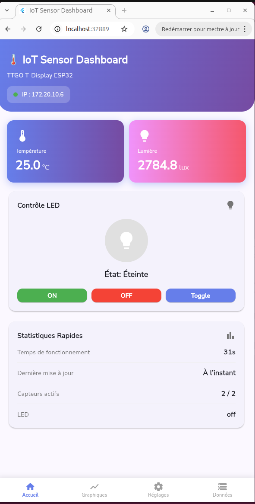
      <p align="center"><strong>Dashboard - LED Éteinte</strong></p>
      <p align="center">Température : 25.0°C | Lumière : 2784.8 lux</p>
    </td>
    <td width="50%">
      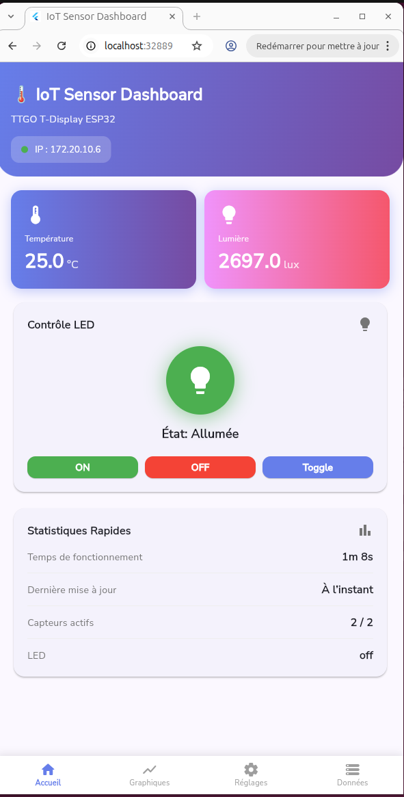
      <p align="center"><strong>Dashboard - LED Allumée</strong></p>
      <p align="center">Contrôle LED avec feedback visuel immédiat</p>
    </td>
  </tr>
</table>

**Fonctionnalités visibles** :
- ✅ Affichage température et lumière en temps réel
- ✅ Contrôle LED (ON/OFF/Toggle)
- ✅ Statistiques rapides (temps de fonctionnement, capteurs actifs)
- ✅ État de connexion ESP32

---

### Page Données (Data) - 4 Formats d'Affichage

<table>
  <tr>
    <td width="50%">
      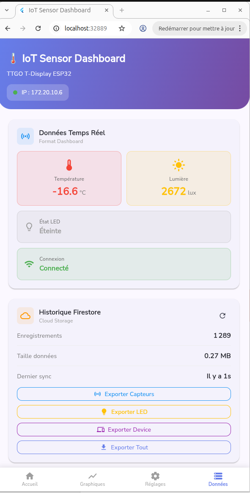
      <p align="center"><strong>Format Dashboard</strong></p>
      <p align="center">Cartes visuelles avec icônes</p>
    </td>
    <td width="50%">
      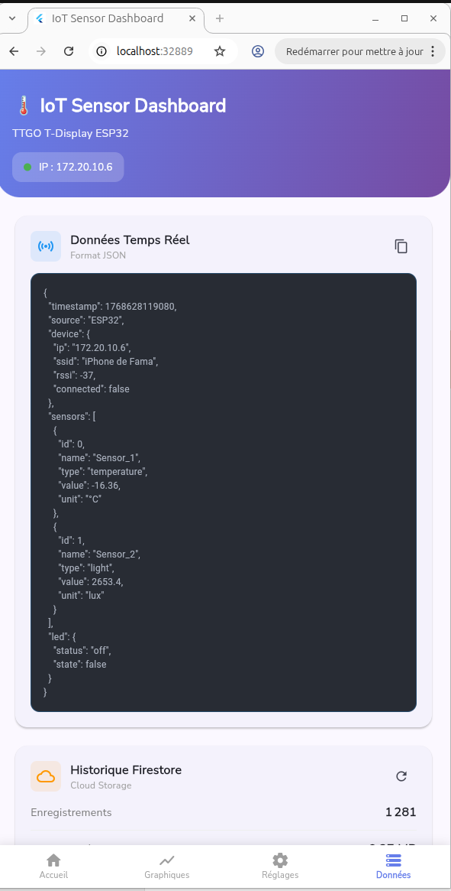
      <p align="center"><strong>Format JSON</strong></p>
      <p align="center">Pretty printer avec coloration syntaxique</p>
    </td>
  </tr>
  <tr>
    <td width="50%">
      
      <p align="center"><strong>Format Texte</strong></p>
      <p align="center">Format lisible pour humains</p>
    </td>
    <td width="50%">
      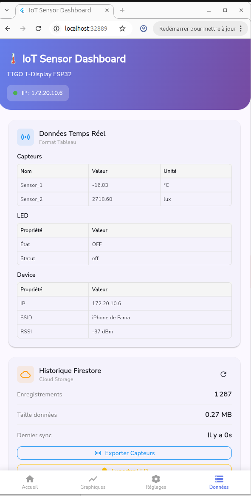
      <p align="center"><strong>Format Tableau</strong></p>
      <p align="center">Présentation tabulaire structurée</p>
    </td>
  </tr>
</table>

**Fonctionnalités visibles** :
- ✅ 4 formats d'affichage (Dashboard, JSON, Texte, Tableau)
- ✅ Sélection du format via menu déroulant
- ✅ Historique Firestore avec métriques (1325 enregistrements, 0.28 MB)
- ✅ Export de données (Capteurs, LED, Device, Tout)
- ✅ Synchronisation temps réel ("Il y a 0s")

---

### Sélecteur de Format

<table>
  <tr>
    <td width="100%">
      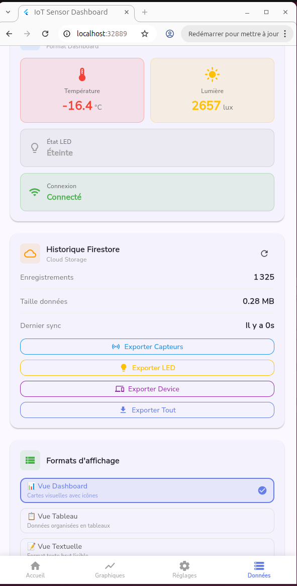
      <p align="center"><strong>Sélecteur de Format d'Affichage</strong></p>
      <p align="center">Interface pour choisir entre Dashboard, Tableau, Texte et JSON</p>
    </td>
  </tr>
</table>

**Fonctionnalités visibles** :
- ✅ Menu de sélection de format
- ✅ Vue Dashboard (cartes visuelles)
- ✅ Vue Tableau (données organisées)
- ✅ Vue Textuelle (format texte lisible)
- ✅ Vue JSON (pretty printer)

---

### Page Historique et Exportation

<table>
  <tr>
    <td width="100%">
      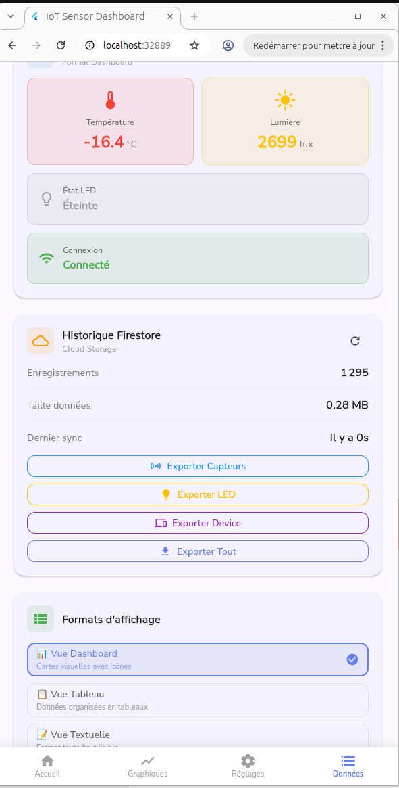
      <p align="center"><strong>Historique Firestore et Exportation</strong></p>
      <p align="center">Statistiques Firestore + Boutons d'export multiples</p>
    </td>
  </tr>
</table>

**Fonctionnalités visibles** :
- ✅ Statistiques Firestore (1295 enregistrements, 0.28 MB)
- ✅ Dernier sync en temps réel
- ✅ Export Capteurs (JSON/CSV/TXT)
- ✅ Export LED (historique des états)
- ✅ Export Device (informations ESP32)
- ✅ Export Tout (archive complète)

---

### Page Graphiques (Charts)

<table>
  <tr>
    <td width="50%">
      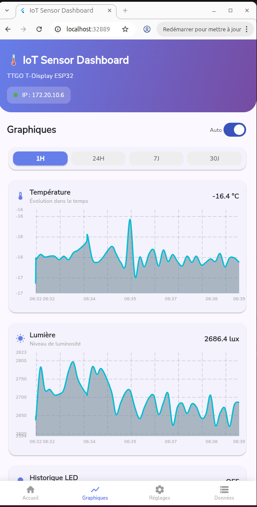
      <p align="center"><strong>Graphiques Température et Lumière</strong></p>
      <p align="center">Période 1H avec auto-refresh</p>
    </td>
    <td width="50%">
      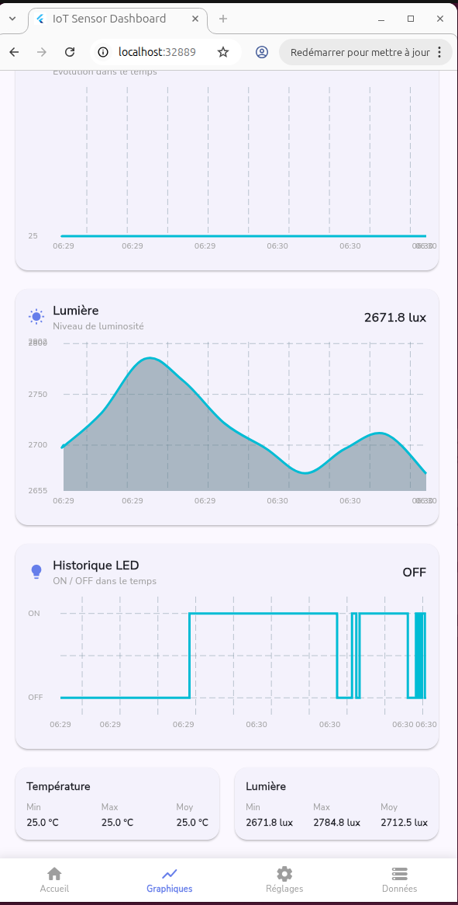
      <p align="center"><strong>Vue Complète avec Statistiques</strong></p>
      <p align="center">Min/Max/Moy + Historique LED</p>
    </td>
  </tr>
</table>

**Fonctionnalités visibles** :
- ✅ Graphiques fl_chart pour température et lumière
- ✅ Sélecteur de période (1H, 24H, 7J, 30J)
- ✅ Auto-refresh activable
- ✅ Historique LED (ON/OFF dans le temps)
- ✅ Statistiques Min/Max/Moy pour chaque capteur
- ✅ Graphiques interactifs avec zoom

---

### Page Réglages (Settings)

<table>
  <tr>
    <td width="50%">
      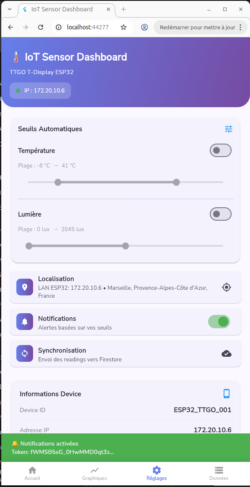
      <p align="center"><strong>Seuils Automatiques Activés</strong></p>
      <p align="center">RangeSliders pour température et lumière</p>
    </td>
    <td width="50%">
      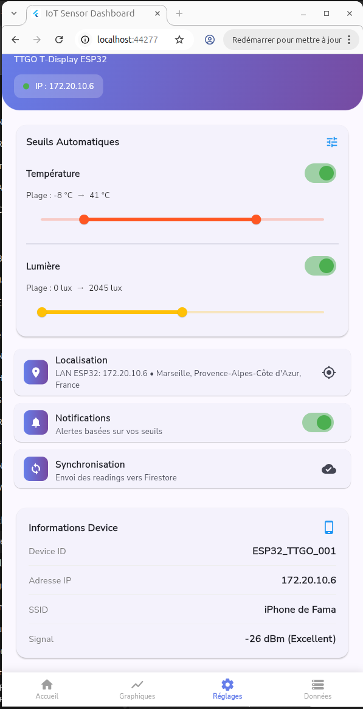
      <p align="center"><strong>Configuration Complète</strong></p>
      <p align="center">Localisation, Notifications, Synchronisation</p>
    </td>
  </tr>
</table>

**Fonctionnalités visibles** :
- ✅ Seuils Automatiques (Température : -8°C → 41°C, Lumière : 0 → 2045 lux)
- ✅ RangeSliders interactifs avec sauvegarde automatique
- ✅ Localisation GPS (Marseille, Provence-Alpes-Côte d'Azur, France)
- ✅ Notifications activables avec token FCM
- ✅ Synchronisation Firestore (envoi automatique)
- ✅ Informations Device (ID, IP, SSID, Signal)
- ✅ Toggle pour activer/désactiver chaque seuil

---

## ⚡ Fonctionnalités Détaillées

### 1️⃣ Affichage des Données des Capteurs

**Formats d'affichage disponibles** :

| Format | Description | Cas d'usage |
|--------|-------------|-------------|
| 📊 **Dashboard** | Cartes visuelles avec icônes colorées | Vue d'ensemble rapide |
| 📋 **JSON** | Pretty printer avec coloration syntaxique | Développement, débogage |
| 📄 **Texte** | Format lisible pour humains | Lecture facile |
| 📊 **Tableau** | Présentation tabulaire structurée | Analyse de données |

**Export des données** :
- 💾 **JSON** : Export complet avec métadonnées
- 📊 **CSV** : Compatible Excel/LibreOffice
- 📄 **TXT** : Format texte simple

**Statistiques Firestore** :
- Nombre total d'enregistrements : **1325**
- Taille des données : **0.28 MB**
- Synchronisation : **Temps réel** ("Il y a 0s")

**Fichiers d'implémentation** :
- `lib/features/sensors/presentation/pages/data_page.dart`
- `lib/features/sensors/bloc/sensors_bloc.dart`

---

### 2️⃣ Contrôle de la LED

**Commandes disponibles** :
- 🔴 **ON** : Allumer la LED
- ⚫ **OFF** : Éteindre la LED
- 🔄 **Toggle** : Inverser l'état

**Interface visuelle** :
- Boutons colorés (Vert=ON, Rouge=OFF, Bleu=Toggle)
- Indicateur visuel d'état (cercle vert/gris)
- Feedback immédiat sur l'action
- Texte d'état ("État: Éteinte" / "État: Allumée")

**Historique** :
- Graphique temporel des changements d'état LED
- Sauvegarde automatique dans Firestore

**Fichiers d'implémentation** :
- `lib/features/led/bloc/led_bloc.dart`
- `lib/features/led/presentation/widgets/led_control_widget.dart`

---

### 3️⃣ Interface de Réglage de Seuil

**Paramètres configurables** :

| Paramètre | Type | Plage | État |
|-----------|------|-------|------|
| 🌡️ **Température** | RangeSlider | -8°C → 41°C | Toggle ON/OFF |
| 💡 **Luminosité** | RangeSlider | 0 → 2045 lux | Toggle ON/OFF |
| 📍 **Localisation** | GPS | Lat/Lng | Marseille, France |
| 🔔 **Notifications** | Switch | ON/OFF | Alertes activées |
| 🔄 **Synchronisation** | Auto | Firestore | Envoi automatique |

**Mécanismes** :
- **Debounce** : Sauvegarde après 1.5s d'inactivité
- **Batch Write** : Sauvegarde atomique (current + history)
- **Feedback visuel** : SnackBar de confirmation
- **Toggle individuel** : Activer/Désactiver chaque seuil

**Informations Device** :
- Device ID : `ESP32_TTGO_001`
- Adresse IP : `172.20.10.6`
- SSID : `iPhone de Fama`
- Signal : `-26 dBm (Excellent)`

**Fichiers d'implémentation** :
- `lib/features/thresholds/presentation/pages/settings_page.dart`
- `lib/services/iot_firebase_service.dart`

---

### 4️⃣ Interface de Statistiques et Graphiques

**Graphiques fl_chart** :

| Graphique | Données | Périodes | Fonctionnalités |
|-----------|---------|----------|-----------------|
| 📈 **Température** | Évolution temporelle | 1H, 24H, 7J, 30J | Min/Max/Moy |
| 💡 **Lumière** | Niveau de luminosité | 1H, 24H, 7J, 30J | Min/Max/Moy |
| 💡 **LED** | Historique ON/OFF | Temps réel | États binaires |

**Statistiques Min/Max/Moy** :
```
Température:
  Min: 25.0 °C
  Max: 25.0 °C
  Moy: 25.0 °C

Lumière:
  Min: 2671.8 lux
  Max: 2784.8 lux
  Moy: 2712.5 lux
```

**Fonctionnalités** :
- ✅ Auto-refresh activable
- ✅ Sélecteur de période (boutons 1H, 24H, 7J, 30J)
- ✅ Graphiques interactifs avec zoom
- ✅ Couleurs distinctives (Cyan pour lignes)

**Fichiers d'implémentation** :
- `lib/features/sensors/presentation/pages/charts_page.dart`
- Package : `fl_chart: ^0.65.0`

---

### 5️⃣ Stockage Persistant Firebase

**Architecture de stockage** :
- ✅ **Firestore** pour la persistance
- ✅ **Batch writes** pour l'atomicité
- ✅ **Streams** pour le temps réel
- ✅ **History subcollections** pour l'audit

**Métriques Firestore** (visibles dans l'app) :
- Enregistrements : **1325 documents**
- Taille données : **0.28 MB**
- Dernier sync : **Il y a 0s** (temps réel)

**Service principal** :
```dart
class IoTFirebaseService {
  final FirebaseFirestore _db;
  final FirebaseMessaging _messaging;
  
  Future<void> saveDeviceSettingsWithHistory({
    required String deviceId,
    required Map<String, dynamic> data,
  }) async {
    final batch = _db.batch();
    batch.set(currentRef, payload, SetOptions(merge: true));
    batch.set(historyRef, payload);
    await batch.commit(); // Atomique
  }
}
```

**Fichiers d'implémentation** :
- `lib/core/firebase/iot_firebase_service.dart`
- `lib/core/constants/firestore_constants.dart`

---

## 🏗️ Architecture

### Pattern BLoC (Business Logic Component)

```
UI Widget → Event → BLoC → Service → API/Firestore → State → UI Widget
```

### Couches de l'Application

```
┌─────────────────────────────────┐
│   Presentation Layer            │  ← Pages, Widgets
│   (UI Components)               │     (home, data, charts, settings)
├─────────────────────────────────┤
│   BLoC Layer                    │  ← SensorsBloc, LedBloc
│   (Business Logic)              │     DeviceBloc
├─────────────────────────────────┤
│   Data Layer                    │  ← IoTFirebaseService
│   (Services & Repositories)     │     NotificationManager
├─────────────────────────────────┤
│   External Layer                │  ← Firebase, HTTP
│   (APIs & Backend)              │     ESP32 REST API
└─────────────────────────────────┘
```

### BLoCs Implémentés

1. **SensorsBloc** : Gestion des données capteurs
    - Events: `LoadSensors`, `RefreshSensors`
    - States: `SensorsInitial`, `SensorsLoading`, `SensorsLoaded`, `SensorsError`

2. **LedBloc** : Gestion de la LED
    - Events: `LoadLedStatus`, `ToggleLed`
    - States: `LedInitial`, `LedLoading`, `LedLoaded`, `LedError`

3. **DeviceBloc** : Gestion du device ESP32
    - Events: `LoadDeviceInfo`, `UpdateDeviceStatus`
    - States: `DeviceInitial`, `DeviceLoading`, `DeviceLoaded`, `DeviceError`

---

## 📦 Installation

### Prérequis

- Flutter SDK >= 3.0.0
- Dart SDK >= 3.0.0
- Firebase CLI
- ESP32 avec API REST fonctionnelle

### Étapes d'Installation

1. **Cloner le projet**
```bash
git clone <votre-repo>
cd flutter_iot_project
```

2. **Installer les dépendances**
```bash
flutter pub get
```

3. **Configuration Firebase**
```bash
# Installer FlutterFire CLI
dart pub global activate flutterfire_cli

# Configurer Firebase
flutterfire configure
```

4. **Configuration ESP32**

Modifier `lib/core/constants/api_constants.dart` :
```dart
static const String esp32BaseUrl = 'http://VOTRE_IP_ESP32';
```

5. **Lancer l'application**
```bash
# Web
flutter run -d chrome

# Android
flutter run -d android

# iOS
flutter run -d ios
```

---

## 📁 Structure du Projet

```
lib/
├── main.dart                           # Point d'entrée
├── app/
│   ├── app.dart                       # Configuration MaterialApp
│   └── di.dart                        # Dependency Injection (GetIt)
├── core/
│   ├── constants/
│   │   ├── firestore_constants.dart   # Chemins Firestore
│   │   └── api_constants.dart         # URLs API ESP32
│   ├── firebase/
│   │   └── iot_firebase_service.dart  # Service Firebase principal
│   └── theme/
│       └── app_theme.dart             # Thème Material Design
├── features/
│   ├── home/
│   │   └── presentation/
│   │       └── pages/
│   │           └── home_page.dart     # Dashboard principal
│   ├── sensors/
│   │   ├── bloc/
│   │   │   ├── sensors_bloc.dart
│   │   │   ├── sensors_event.dart
│   │   │   └── sensors_state.dart
│   │   └── presentation/
│   │       ├── pages/
│   │       │   ├── data_page.dart     # Page données (4 formats)
│   │       │   ├── charts_page.dart   # Graphiques fl_chart
│   │       │   └── history_page.dart  # Historique
│   │       └── widgets/
│   ├── led/
│   │   ├── bloc/
│   │   │   ├── led_bloc.dart
│   │   │   ├── led_event.dart
│   │   │   └── led_state.dart
│   │   └── presentation/
│   │       └── widgets/
│   ├── device/
│   │   ├── bloc/
│   │   │   ├── device_bloc.dart
│   │   │   ├── device_event.dart
│   │   │   └── device_state.dart
│   │   └── presentation/
│   │       └── widgets/
│   │           └── device_info_card.dart
│   └── thresholds/
│       └── presentation/
│           └── pages/
│               └── settings_page.dart  # Page réglages
├── services/
│   ├── notification_manager.dart       # Firebase Cloud Messaging
│   └── location_service.dart           # Géolocalisation GPS
└── shared/
    └── presentation/
        └── widgets/
            └── app_header.dart         # Header réutilisable


```

---

## 🔥 Collections Firestore

### 1. sensors

Stockage des mesures des capteurs :
```javascript
{
  "auto_id_1": {
    "temperature": 25.5,
    "light": 1500,
    "deviceId": "esp32_device",
    "location": "Bureau",
    "timestamp": Timestamp
  }
}
```

### 2. led_status

Historique des états de la LED :
```javascript
{
  "auto_id_1": {
    "state": true,
    "deviceId": "esp32_device",
    "changedAt": Timestamp,
    "triggeredBy": "manual"
  }
}
```

### 3. device_info

Informations du device ESP32 :
```javascript
{
  "esp32_device": {
    "ipAddress": "172.20.10.6",
    "lastSeen": Timestamp,
    "isConnected": true,
    "firmware": "1.0.0",
    "ssid": "iPhone de Fama",
    "rssi": -26,
    "location": {
      "latitude": 43.2965,
      "longitude": 5.3698,
      "label": "Marseille, France"
    }
  }
}
```

### 4. settings

Configuration actuelle + historique :
```javascript
{
  "esp32_device": {
    "temperature": {
      "min": -8,
      "max": 41,
      "enabled": true
    },
    "light": {
      "min": 0,
      "max": 2045,
      "enabled": true
    },
    "location": "Marseille, France",
    "notificationsEnabled": true,
    "updatedAt": Timestamp,
    "platform": "web",
    "history": {
      "auto_id_1": {
        "temperature": {...},
        "updatedAt": Timestamp
      }
    }
  }
}
```

---

## 🌐 API REST ESP32

### Endpoints Implémentés

#### GET /data
Récupère les données des capteurs

**Réponse** :
```json
{
  "temperature": 25.5,
  "light": 1500,
  "led": false,
  "timestamp": 1705401234567
}
```

#### POST /led/on
Allume la LED

**Réponse** :
```json
{
  "led": true,
  "message": "LED allumée"
}
```

#### POST /led/off
Éteint la LED

**Réponse** :
```json
{
  "led": false,
  "message": "LED éteinte"
}
```

#### POST /led/toggle
Inverse l'état de la LED

**Réponse** :
```json
{
  "led": true,
  "message": "État LED inversé"
}
```

---

## 🎨 Design et UX

### Material Design 3

L'application utilise **Material Design 3** (Material You) avec :
- Thème clair/sombre adaptatif
- Composants standards Material
- Animations fluides
- Feedback visuel

### Palette de Couleurs

- **Primaire** : Bleu (#2196F3) - Fiabilité, technologie
- **Secondaire** : Orange (#FF9800) - Énergie, alertes
- **Succès** : Vert (#4CAF50) - Confirmations
- **Erreur** : Rouge (#F44336) - Alertes critiques

### Animations

- Shimmer effect pour loading
- Fade in/out pour apparitions
- CircularProgressIndicator pour chargements
- Slide transitions pour navigation

---

## 👥 Auteurs

- **[GROUPE 5]** - Architecture BLoC, intégration Firebase
- **[GROUPE 5]** - UI/UX, tests unitaires
- **[GROUPE 5]** - ESP32 API, Cloud Functions (si trinôme)

**Projet** : Interface Flutter pour Capteur IoT ESP32  
**Établissement** : [Université de Montpellier]  
**Année** : 2025-2026

---

## 📄 Licence

Projet académique - 2025-2026

---

## 🔗 Ressources

- [Flutter Documentation](https://docs.flutter.dev)
- [Firebase Documentation](https://firebase.google.com/docs)
- [BLoC Library](https://bloclibrary.dev)
- [ESP32 Documentation](https://docs.espressif.com)
- [fl_chart Package](https://pub.dev/packages/fl_chart)

---

**Made with ❤️ using Flutter & Firebase**